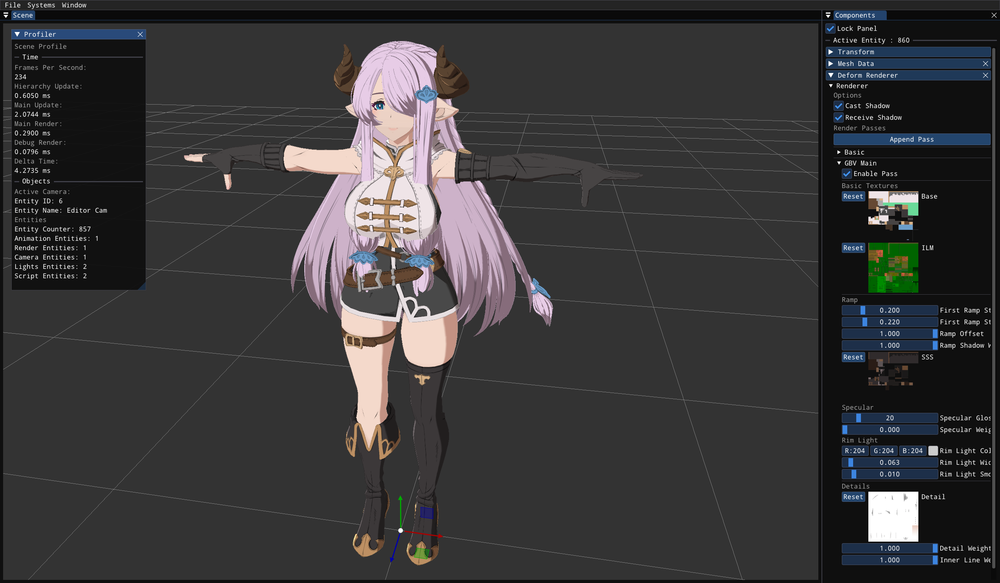
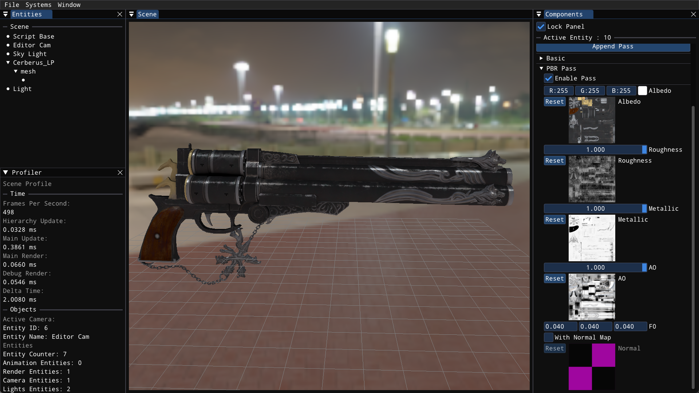
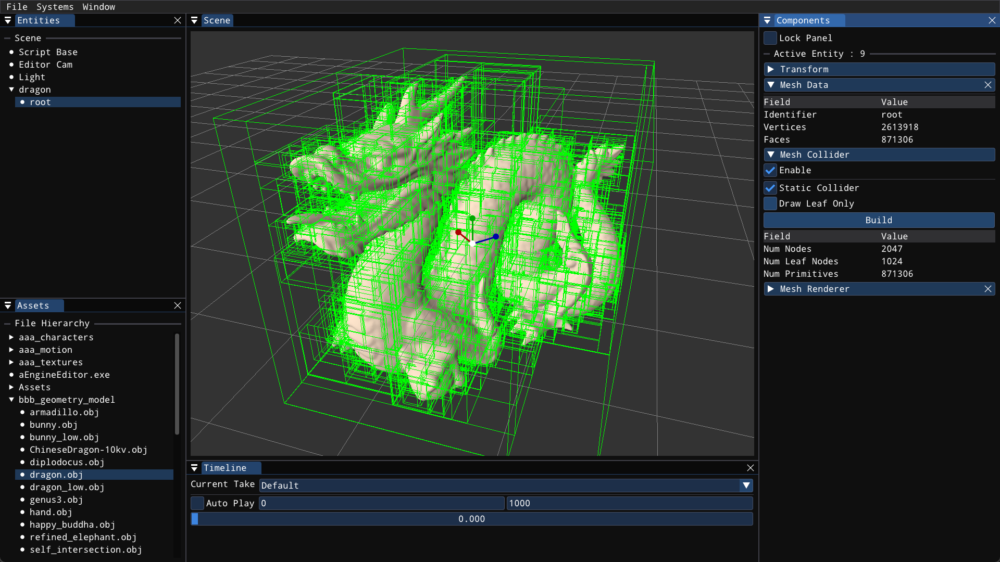

# Introduction

`aEngine` is an ECS based game engine aimed to provide a sandbox environment for rapid prototyping.

In ECS architecture, each scene consists of a number of entities (game object) in hierarchy.

These entities store the indices to components which holds the actual data (meshes, materials, motions etc.).

In each main loop, all components are maintained by corresponding systems. For example, the `NativeScript` component will be maintained by `NativeScriptSystem`.

## Features

- Native scripting system and API.
- PBR and NPR shaders for static mesh and skinned mesh.
- Extensible multi-pass forward rendering pipeline.
- Data structure for mocap data (.bvh, .fbx motion files).
- Real time collision system.

## How To Compile

The project depends on OpenGL 4.6, ONNX runtime 1.9.0. Other dependencies can be directly retreived with `git clone --recursive ...`.

ONNX runtime is optional, you can disable it by setting the cmake variable `NN_MODULE` to `OFF`. If you do need this feature, reference `Engine/cmake/FindONNXRuntime.cmake` for more details.

You need to have `cmake >= 3.20` to properly execute the cmake scripts.

## Scripting System

To manipulate the scene with custom function is the core to a game engine. Feel free to check the APIs related to scene object manipulation (AddComponent, GetComponent, GetSystemInstance etc.) in file `Engine/Scene.hpp`.

Each native script component can **bind** multiple scriptable derive classes. For example, to write a controller that takes user input and change the property of active camera on the scene:

```cpp
#include "API.hpp"
class CameraController : public Scriptable {
public:
  void Update(float dt) override {
    ...
  }

  // draw helper to scene window
  void DrawToScene() override {}

  // draw imgui utils in inspector window of editor
  void DrawInspectorGUI() override {}
};
```

The `Update` function from Scriptable will get called once each frame. There are other functions you can overload (`LateUpdate`, `DrawToScene` etc.). Check `Engine/Base/Scriptable.hpp` for more details.

After implementing our own controller, we need to **bind** this controller class to some entity on the scene so that it will get executed by `NativeScriptSystem`. For example, in your game code:

```cpp
// GWORLD is a singleton handle for current scene
auto entity = GWORLD.AddNewEntity();
entity->AddComponent<NativeScript>();
entity->GetComponent<NativeScript>()->Bind<CameraController>();
```

When you no longer want this script to execute, you can either set it to disabled or remove it with:
```cpp
entity->GetComponent<NativeScript>()->Unbind<CameraController>();
```

Each `NativeScript` component can bind multiple scriptables, but each type of scriptable is only allowed one instance.

```cpp
entity->GetComponent<NativeScript>()->Bind<CameraController>();
// This is allowed, both scriptable will get executed
entity->GetComponent<NativeScript>()->Bind<CharacterController>();
// This will overwrite previous scriptable of the same type
entity->GetComponent<NativeScript>()->Bind<CameraController>();
```

Check `Engine/Component/NativeScript.hpp` for more details.

## Render System

Here are some screen shots of the rendering from this engine:





The main code for render system lies in `Engine/System/RenderSystem`, however, there are some sub-systems that work tightly with render system (`CameraSystem`, `LightSystem` etc.).

Entities with `MeshRenderer` or `DeformRenderer` component will be maintained by the render system. The `DeformRenderer` holds a pointer to a private `MeshRenderer` instance and performs mesh skinning based on compute shader by modifying the targetVBO of a mesh before actual render code, check more details at `Engine/Component/DeformRenderer`.

Each `MeshRenderer` holds an array of `RenderPass`, each render pass is a derived class of the `BasePass` in `Function/Render/RenderPass`. The `BasePass` class configrues some built-in uniform variables (ModelToWorldPoint, ModelToWorldDir, ViewDir, etc.). You can override functions in `BasePass` to do custom rendering:

```cpp
class CustomPass : public BasePass {
public:
  CustomPass() {
    // setup shader in the constructor
    shader = Loader.GetShader(...);
    // setup other default values
    ...
  }
  // This function will gets called after draw call
  // (reset states, free resources etc.)
  void FinishPass() override {}
private:
  // This function gets called before the draw call
  void BeforePass() override {
    shader->Use();
    // setup custom uniform variables, switch states, fill SSBOs, etc.
  }
  // This draws the inspector gui, make it easier to tune parameters
  void DrawInspectorGUI() override {
    ImGui::SliderFloat(...);
  }
};
```

There are more functions you can override to make your own rendering, check `Function/Render/RenderPass` for examples more details.

Once you finish your own render pass, you can add this pass to a `MeshRenderer` to make it works. I provide a function `AddPass` in the component to make it easier. You can also check `drawAppendPassPopup` function in `MeshRenderer` to see how to add the new pass in inspector gui.

### More Details

Currently, the engine only supports forward rendering. As mentioned above, the `BasePass` setup some default uniforms for you, including the lights. Each light in the scene has a `Light` component maintained by `LightSystem`. This system don't keep an active buffer for these light, but maintains a member variable `Lights` in `RenderSystem`. Before the actual rendering, `RenderSystem` will fill in a buffer object with the lights data, and bind this buffer object as a shader storage buffer for shaders to access.

## Physics System

### Collision Detection

The very basis of a physics system is a robust collision detection system. I wrote a simple collision detection system that deal with mesh-mesh collision, mesh-primitive collision and mesh-ray collision in `System/SpatialSystem`.

For mesh-mesh collision detection, brute force has `O(n^2)` time complexity, which is inpractical for realtime application. I used a simple Bound Volumn Hierarchy data structure to accelerate the collision detection. Feel free to check more details in `Function/Spatial/BVH`. Currently, the bvh build and traverse are purely on cpu, I planned to implement another version on gpu latter.

Here's a screen shot of the bvh data structure:



## Animation System

The animation system is based on the data structure describing the mocap data, you can find it in `Function/Animation/Motion`.

Each motion contains one `Skeleton` and an array of `Pose`, we need to apply the motion data in each `Pose` to specific `Skeleton` to get the final animation.

The `Skeleton` holds information for all joints (parent-child relation, names, relative transforms etc.) and the `Pose` records the relative transform for all joints in one frame.

A simple neural retargeting script for character with varied skeleton is provided in `Scripts/Animation/SAMERetarget`. Here's a simple demo to it:

[neural_retargeting.webm](https://github.com/user-attachments/assets/fc87cc00-2e0b-4929-ac66-5bc6f7f236d2)
