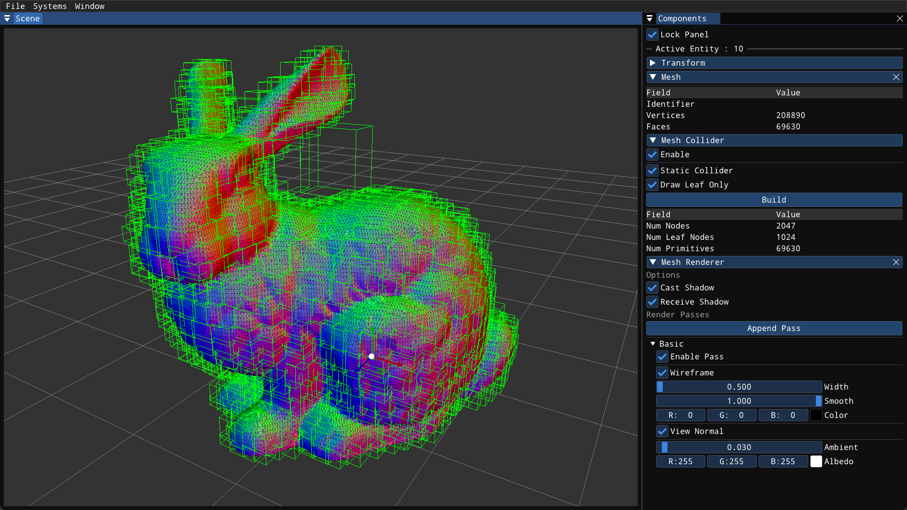

# Introduction

`aEngine` is an ECS based game engine aimed to provide a sandbox environment for rapid prototyping.

In ECS architecture, each scene consists of a number of entities (game object) in hierarchy.

These entities store the indices to components which holds the actual data (meshes, materials, motions etc.).

In each main loop, all components are maintained by corresponding systems. For example, the `NativeScript` component will be maintained by `NativeScriptSystem`.

## Features

- Native scripting system and API.
- PBR and NPR shaders for static mesh and skinned mesh.
- Extensible multi-pass forward rendering pipeline.
- Data structure for mocap data (.bvh, .fbx motion files).
- Real time collision system.

## How To Compile

The project depends on OpenGL 4.6, CGAL and boost. It's recommended to use [vcpkg](https://github.com/microsoft/vcpkg) to fetch CGAL and boost as these two packages are added with `find_package` in cmake.

You need to have `cmake >= 3.20` to properly execute the cmake scripts. C++17 compatible compiler is also required.

## Scripting System

To manipulate the scene with custom function is the core to a game engine. Feel free to check the APIs related to scene object manipulation (AddComponent, GetComponent, GetSystemInstance etc.) in file `Engine/Scene.hpp`.

Each native script component can **bind** multiple scripts derived from class `Scriptable`. For example, a controller class could have the following structure:
```cpp
#include "API.hpp"
class CameraController : public Scriptable {
public:
  void Update(float dt) override {
    // the main logic
  }
  void LateUpdate(float dt) override {
    // the rest of the logic
  }

  void OnEnable() override {}
  void OnDisable() override {}

  // draw helper to scene window
  void DrawToScene() override {}

  // draw imgui utils in inspector window of editor
  void DrawInspectorGUI() override {}
};

// A script must be `registered` with this macro to
// successfully compile.
REGISTER_SCRIPT(::, CameraController)
```

The `Update` function from Scriptable will get called once each frame while the `LateUpdate` function gets called after all `Update` function on the scene are executed. The `OnEnable` and `OnDisable` functions only gets called when enable/disable this script from the inspector window. Check `Engine/Base/Scriptable.hpp` for more details.

After implementing our own controller, we need to **bind** this controller class to some entity on the scene so that it will get executed by `NativeScriptSystem`. For example, in your game code:

```cpp
// GWORLD is a singleton handle for current scene
auto entity = GWORLD.AddNewEntity();
entity->AddComponent<NativeScript>();
entity->GetComponent<NativeScript>()->Bind<CameraController>();
```

When you no longer want this script to execute, you can either set it to disabled or remove it with:
```cpp
entity->GetComponent<NativeScript>()->Unbind<CameraController>();
```

Each `NativeScript` component can bind multiple scriptables, but each type of scriptable is only allowed one instance.

```cpp
entity->GetComponent<NativeScript>()->Bind<CameraController>();
// This is allowed, both scriptable will get executed
entity->GetComponent<NativeScript>()->Bind<CharacterController>();
// This will overwrite previous scriptable of the same type
entity->GetComponent<NativeScript>()->Bind<CameraController>();
```

Check `Engine/Component/NativeScript.hpp` for more details about this part.

If you want to have customize the look of your script from the inspector window, place your logic in the function `DrawInspectorGUI`. I simply use raw `imgui` and some helper functions in `Function/GUI/Helpers`, so it should be very straight forward if you are familiar with `imgui`, lets say you want to modify the value of a float with imgui sliders:

```cpp
class CameraController : public Scriptable {
public:
  ...
  float someVariable;
  void DrawInspectorGUI() override {
    ImGui::SliderFloat("Some Variable", &someVariable, 0.0f, 1.0f);
  }
  ...
};
```

And that's it. I also embed `ImPlot` library with imgui, so you can plot beautiful visualizations easily. Open `Window/Show ImPlot(ImGui) Demo` tab if you would like to see what these libraries provides.

Another thing that's worth mentioning is the serialization of a the scene. Normally we would like to save the changes or setups we made into a file, and directly open this file if we want to show our scene to others. Complete serialization and deserialization are supported in this engine. You can serialize your script, render pass and custom components inside one `.scene` file.

Making your script serializable is done by the macro `REGISTER_SCRIPT`, you can also use the macro `REGISTER_SCRIPT_SL` if you want to have serialize and deserialize seperated. Serialize the variables in your script can be done as follows:

```cpp
class CameraController : public Scriptable {
public:
  ...
  float var1;
  glm::vec2 var2;
  std::map<int, float> var3;
  template<typename Archive> void serialize(Archive &ar) {
    ar(var1, var2, var3);
  }
  ...
};
REGISTER_SCRIPT(::, CameraController)
```

Use seperated serialize and deserialize functions:

```cpp
class CameraController : public Scriptable {
public:
  ...
  float var1;
  glm::vec2 var2;
  std::map<int, float> var3;
  template<typename Archive> void save(Archive &ar) const {
    ar(var1, var2, var3);
  }
  template<typename Archive> void load(Archive &ar) {
    ar(var1, var2, var3);
  }
  ...
};
REGISTER_SCRIPT_SL(::, CameraController)
```

The library [cereal](https://uscilab.github.io/cereal/) is used to handle the serialization, feel free to check their detailed document if you have more advanced needs.

## Animation System

The animation system is based on the data structure describing the mocap data, you can find it in `Function/Animation/Motion`.

Each motion contains one `Skeleton` and an array of `Pose`, we need to apply the motion data in each `Pose` to specific `Skeleton` to get the final animation.

The `Skeleton` holds information for all joints (parent-child relation, names, relative transforms etc.) and the `Pose` records the relative transform for all joints in one frame.

### Motion Retargeting

A simple neural retargeting script for character with varied skeleton is provided in `Scripts/Animation/SAMERetarget`. Here's the [demo](https://www.bilibili.com/video/BV1hypgeAEBN/?vd_source=bcaf713b6b1c92e7d54cf304c76ff4d2).

### Motion Matching

A simple motion matching script is also included in `Scripts/Animation/MotionMatching`, thanks to this wonderful [tutorial](https://theorangeduck.com/page/code-vs-data-driven-displacement). Here's the [demo](https://www.bilibili.com/video/BV1cQyKYBEwM/?share_source=copy_web&vd_source=0cb925840feb398743148accc03d1742).

So motion matching is a simple but effective method to do character animation. Given a database of motions, we construct a feature representing the current state of the character (user input, previous motion, future trajectories etc.), and query the database for a closest neighbor, the smoothly transition current motion to that neighbor.

Instead of searching the database each frame, I carry out the search every N frames, this variable can be configured with `searchFrame` in my script. From my observation, this is a trade off between responsiveness and performance.

I implemented a kd-tree to perform nearest neighbor search, but latter realised that this kd-tree is actually slower than brute force for my 31 dimensional feature. The reason for that is, when the dimension of our data is really high (much larger than 2 and 3), kd-tree don't have much advantage over brute force (O(n)). And we are accessing the memory more often than simply traverse all data since we need the data structures. So it could be slower. Refer to `Tests/Datastructure/kdtree` for a detailed test.

During my actual implementation, I find the following aspects especially important to create high quality feature:

1. Scale the feature with the database's mean and variance would improve the quality of the search.
2. Construct the feature based on some data from currentFrame+1 in the database would make the motion smoother.

For the motion transition, I keep record of a delta rotation between current motion and the motion I'm about to transition to. Decay the delta rotation with time, and add the delta back from transitioned motion.

```
// after one search
delta_rot = cur_rot * inv(next_rot)

// during update
delta_rot = slerp(delta_rot, id_rot, alpha)
cur_rot = delta_rot * next_rot
```

## Render System

Here are some screen shots of the rendering from this engine:


The main code for render system lies in `Engine/System/RenderSystem`, however, there are some sub-systems that work tightly with render system (`CameraSystem`, `LightSystem` etc.).

Entities with `MeshRenderer` or `DeformRenderer` component will be maintained by the render system. The `DeformRenderer` holds a pointer to a private `MeshRenderer` instance and performs mesh skinning based on compute shader by modifying the targetVBO of a mesh before actual render code, check more details at `Engine/Component/DeformRenderer`.

Each `MeshRenderer` holds an array of `RenderPass`, each render pass is a derived class of the `BasePass` in `Function/Render/RenderPass`. The `BasePass` class configrues some built-in uniform variables (ModelToWorldPoint, ModelToWorldDir, ViewDir, etc.). You can override functions in `BasePass` to do custom rendering:

```cpp
class CustomPass : public BasePass {
public:
  CustomPass() {
    // setup shader in the constructor
    shader = Loader.GetShader(...);
    // setup other default values
    ...
  }
  // This function will gets called after draw call
  // (reset states, free resources etc.)
  void FinishPass() override {}
private:
  // This function gets called before the draw call
  void BeforePass() override {
    shader->Use();
    // setup custom uniform variables, switch states, fill SSBOs, etc.
  }
  // This draws the inspector gui, make it easier to tune parameters
  void DrawInspectorGUI() override {
    ImGui::SliderFloat(...);
  }
};
// for serialization purpose, very similar to scripts
REGISTER_RENDER_PASS(::, CustomPass)
```

There are more functions you can override to make your own rendering, check `Function/Render/RenderPass` for examples more details.

Once you finish your own render pass, you can add this pass to a `MeshRenderer` to make it works. I provide a function `AddPass` in the component to make it easier. You can also check `drawAppendPassPopup` function in `MeshRenderer` to see how to add the new pass in inspector gui.

## Physics System

### Collision Detection

The very basis of a physics system is a robust collision detection system. I wrote a simple collision detection system that deal with mesh-mesh collision, mesh-primitive collision and mesh-ray collision in `System/SpatialSystem`.

For mesh-mesh collision detection, brute force has `O(n^2)` time complexity, which is inpractical for realtime application. I used a simple Bound Volumn Hierarchy data structure to accelerate the collision detection. Feel free to check more details in `Function/Spatial/BVH`. Currently, the bvh build and traverse are purely on cpu, I planned to implement another version on gpu latter.

Here's a screen shot of the bvh data structure:

