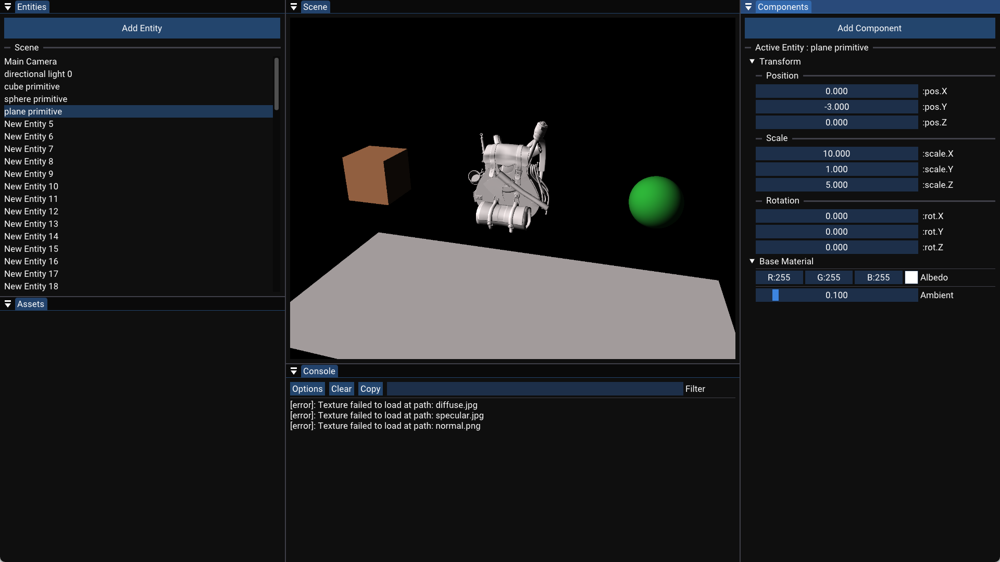

# Engine

An experimental ECS game engine.

## Road maps

### High level goals

- Implement a opengl pbr render system.
- Manage the layout system and gui system
- Create easy to use animation system
- Implement a home made physics system

### Detailed goals

- [x] Create the camera system to manage the movement of camera
- [x] Polish the component gui section, create editor for transform and camera component
- [x] Create a basic material editor, write some actual shader code
- [x] Create hierarchy system for the scene to update all the local transforms
- [ ] Design the filesystem carefully
- [ ] Update the material class, introduce reflection to offer more custom material designs
- [ ] Support multi-pass rendering, allow user control from the material pannel
- [ ] More realistic render effects (PBR, IBL, BRDF ... )
- [ ] Integrate imgui gizmos library, make it easier to manipulate the scene
- [ ] Create the animation system, write code to do the skinning and binding

## ECS architecture

ECS (Entity Component System) atchitecture is a very important thinking in developing this engine. Entity is the actual game object in the scene on which we can attach various components. The components stores the neccessary data needed for the tasks defined in different systems.

Take rendering as an example, each renderable mesh object shold have a `MeshRenderer` component storing the actual mesh data. The texture and other parameters are defined in the component `Material`. When we want to render the entity. We would call the `Update` function defined in `RenderSystem`, use the `EntityManager` singleton to retrieve all the components related to this entity.

The advantage of ECS architecture is that, the component can be stored in a more compact (memory efficient) way. Special mechanics can also be designed to update components with specific types easily.

## The main loop

The main loop can be found at `main`:

```cpp
Core.Initialize();
Timer.Initialize();
Event.Initialize();

while (Core.Run()) {
  Timer.Tick();
  Event.Poll();
  Core.Update();
}
```

After initialization to the `Core`, `Timer` and `Event` singleton instances, the main loop calls `Timer.Tick()` to capture the `DeltaTime` needed by some systems, `Event.Poll()` to poll all glfw events and custom actions, clear the queue from last loop and push new actions, `Core.Update()` to do the main update.

The detail about `Core.Update()` can be found at `engine/Engine`:

```cpp
void Engine::Initialize() {
  // register all the systems
  ECS::EManager.RegisterSystem<BaseLightSystem>();
  ECS::EManager.RegisterSystem<RenderSystem>();
  ECS::EManager.RegisterSystem<CameraSystem>();
  // start all the systems
  ECS::EManager.Start();
}

void Engine::Update() {
  ECS::EManager.Update();
}

void Engine::Quit() {
  glfwSetWindowShouldClose(window, GLFW_TRUE);
  run = false;
}
```

So the initialization register all the known systems and create instances for each of them. The `Update` function calls another update function defined in the `EntityManager` to perform the update of all the registered systems:

```cpp
class EntityManager {
public:
  ...
  // Update all the registered systems
  void Update() {
    for (auto &system : registeredSystems) {
      system.second->Update();
    }
  }
  ...
};
```

Currently, the order of system registration can determine the system's order in the member variable `registeredSystems`, so be careful with the order of registration in case some system depends on the result of another system.

Another special design is the `Transform` and `Entity`, in previous version, these are different class, `Transform` acts as a component that can be attached to a `Entity` and get updated from some `BaseSystem` derived systems. However, I find it hard to easily maintain the hierarchy structure of entities with these two seperated. So I combined these two classes into one in the file `ecs/base/EntityManager`, `Transform` is now an alias to `Entity`.

## The hierarchy

As can be found in the `Entity` class, each entity now holds a pointer to its parent and an array of pointer to all its direct children:

```cpp
class Entity {
public:
  ...
  Entity *parent = nullptr;
  vector<Entity *> children;
  ...
};
```

As Transform and Entity are the same class now, each entity hold the transform data `position`, `scale` and `rotation`. At the start of each loop, the global properties are updated with the local properties. All local properties are relative to this entity's parent axis, some special notes includes:

```
self.globalRot = parent.globalRot * self.localRot

M_p.inv * M * (self.globalPos - parent.globalPos) = self.localPos
M.inv * M_p * localPos + parent.globalPos = self.globalPos

self.globalScale = parent.globalScale * self.localScale
```

These update process can be found at `ecs/base/EntityManager`:

```cpp
  void Update() {
    // update the transforms first
    recomputeLocalAxis();
    rebuildHierarchyStructure();

    // update all the registered systems
    for (auto &system : registeredSystems) {
      system.second->Update();
    }
  }
```

## The rendering

Currently, the rendering is divided into the following sections:

1. `ecs/systems/camera/CameraSystem`: Manipulates the movement of camera
2. `ecs/systems/render/RenderSystem`: Render the renderable objects (with `MeshRenderer` component)
3. `ecs/systems/light/LightSystem`: Maintain the `activeBaseLights` array in `RenderSystem`
4. `engine/EditorWindows`: Plots the GUI

The declaration of shader variable and assets variable can be found at `ecs/systems/render/README`.

### 2024.07.28

Here's a breif view of this engine at this stage.

<center>

</center>

The logic behind the system is that, the components stores the data and the system update related components in some `Update` function.

Take `CameraSystem` as an example. This system defines how would the camera respond to user input, of course this system should only have effect on the entities possessing the `Camera` component and a `Transform` component. So we need to do the registration at the initialization of this system:

```cpp
class CameraSystem : public ECS::BaseSystem {
public:
  CameraSystem() {
    AddComponentSignature<Transform>();
    AddComponentSignature<Camera>();
  }

  void Update() {...}
}
```

After calling the function `AddComponentSignature` defined in `CameraSystem`'s base class `ECS::BaseSystem`, we can inform the EntityManager that the `CameraSystem` should only update the states of some specific camera entities.

To respond the user input, we kept record of a `activeCamera` in the editor and process keybord and mouse events accordingly.

When it comes to the rendering, we has `RenderSystem` maintaining an array of entities with `MeshRenderer` component in which we keep a pointer to the actual Mesh data structure. All the meshes, textures and shaders are maintained by the `resource/ResourceManager`. We can have the ResourceManager load and store some assets by calling `GetXXX` function. After the function call the ResourceManager would load the asset if it has not been loaded before, and returns a pointer to the asset data.

The `MeshRenderer` component take the `MVP matrix`, `activeLights` and a `BaseMaterial` instance as its paramter for the `Render` function. The `MVP matrix` can be computed from the `activeCamera` maintained by `EditorWindows`, while the `activeLights` is an array inside the `RenderSystem` maintained by `LightSystem`. The `BaseMaterial` should be a component of the renderable entity, however, if no material is found to the renderable entity, a default material will be assigned.

The `BaseMaterial` is a component maintaining the neccessary variables and textures needed for the rendering. It kept a pointer to an active shader loaded by the ResourceManager, and has other neccessary variables like `albedo`, `smoothness` as its public member variable.

The render pipeline is very simple and straight forward:

```cpp
class MeshRenderer : public ECS::BaseComponent {
public:
  ...
  void Render(mat4 projMat, mat4 viewMat, Transform &transform, BaseMaterial *material, vector<BaseLight> &lights) {
    Resource::Shader *shader = material->GetShader();
    shader->Use();
    shader->SetMat4("projection", projMat);
    shader->SetMat4("view", viewMat);
    shader->SetMat4("model", transform.GetModelMatrix());
    material->SetFixedVariables();
    material->SetBaseLights(lights);
    material->ActivateTextures();
    meshData->Draw(*shader);
  }
  ...
};
```

To support multiple kinds of materials and render pipeline is still an issue. Doing that would require writing a new `MeshRenderer-ish` component and a new `BaseMaterial-ish` component.

## The gui layout

The gui system is based on [imgui](https://github.com/ocornut/imgui) docking branch. The layouts are defined in the file `engine/EditorWindows`. All the layouts are rendered in the `RenderSystem` by the singleton class `EditorContext` as follows:

```cpp
class RenderSystem : public ECS::BaseSystem {
public:
  RenderSystem() {
    AddComponentSignature<Transform>();
    AddComponentSignature<MeshRenderer>();
  }
  ~RenderSystem() {}
  ...
  void Update() override {
    EditorContext.RenderStart(sceneBuffer);
    sceneBuffer->Bind();
    // ...
    // the main rendering
    // ...
    sceneBuffer->Unbind();

    EditorContext.RenderComplete();
    glfwSwapBuffers(&Core.Window());
  }
  ...
};
```

The member variable `sceneBuffer` is a opengl framebuffer object on which all the rendering of the scene occours. After the scene is rendered into a texture. The texture will be displayed with a `ImGui::Image` at the position of the `scene` window.

## The animation

...

## The physics

...